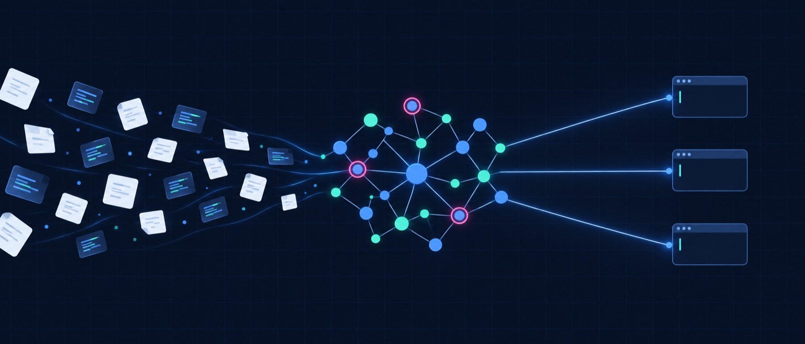
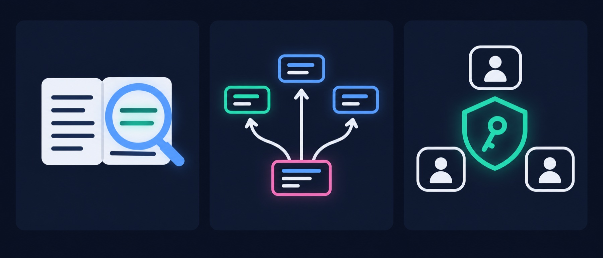
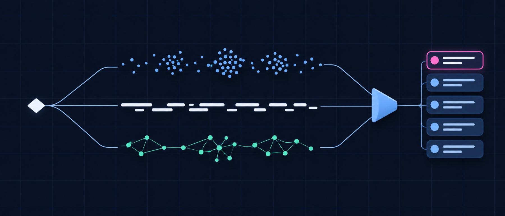
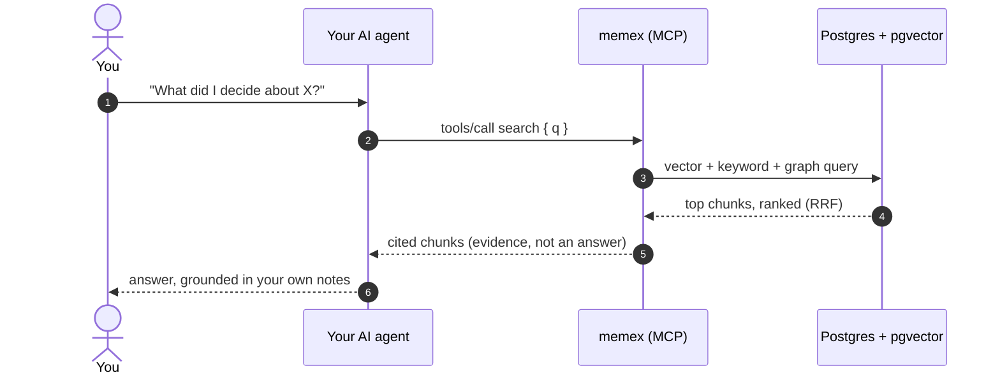

<div align="center">

# memex

memex is a self-hosted memory server for your AI agents. It indexes your markdown
notes and your code (TypeScript, Python, Go, Bash, SQL), and it answers any MCP
client with cited evidence from hybrid vector + keyword + entity-graph search.



[](./LICENSE)


</div>

Your notes, index and database stay in your AWS account. Only what an agent
retrieves goes to that agent's model.

## See it work

<div align="center">
  
</div>

Connect once, then ask in plain words. memex returns the evidence, cited to the
exact page. Your agent writes the answer.

```bash
claude mcp add --transport http memex https://<subdomain>.<domain>/mcp \
  --header "Authorization: Bearer <token>"
```

<details>
<summary>See a full search with <code>--explain</code></summary>

On the host, the CLI runs the same retrieval the MCP `search` tool does, and
`--explain` stamps per-signal ranking attribution on every hit:

```bash
docker exec deploy-memex-1 bun run src/cli.ts search "<query>" --k 5 --explain
```

</details>

## What you get

You write notes, decisions and code, and six months later neither you nor your
agent can find them. memex reads all of it once, keeps it searchable, and hands
that search to every MCP client you use, with the source attached.



| What you get | Why it matters |
|---|---|
| **Hybrid search** | Vector and keyword arms fused with Reciprocal Rank Fusion. With the runtime defaults, a search makes one Titan embed call and no chat-model call. |
| **Code intelligence** | `code_callers`, `code_callees`, `code_def`, `code_refs`, `code_blast` (transitive callers, depth 5 by default, max 8) and `code_flow`, over TS/TSX, Python and Go. |
| **Push context** | `volunteer_context` surfaces relevant pages and `volunteer_chronicle` the recent timeline for the entities in play, before you ask. Both are deterministic, with no LLM call. |
| **Facts, timelines, history** | `add_fact` / `recall` / `find_trajectory`, the `chronicle_*` tools, and `page_versions` / `page_revert` for every page. |
| **Team-ready** | One connector for a team, a separate source per person through single-use enrollment codes, and daily USD caps per OAuth client, per PAT and per person. |
| **Secrets redacted on write** | Pasted AWS keys, API tokens and PEM keys become `[REDACTED:<kind>:<fingerprint>]` before they are stored or embedded. |
| **Your infra** | One Graviton `t4g.medium` instance and encrypted RDS Postgres 16, all in Terraform. Zero telemetry. |

91 MCP tools, each declared once in [deploy/memex/src/mcp/operations.ts](./deploy/memex/src/mcp/operations.ts); `tools/list` returns them with their schemas.

**When memex is not the right fit**

- You do not want to run an AWS account.
- You want a hosted service someone else operates.
- You want a chat UI. memex retrieves; composing the answer is the MCP client's job.

## How it works

memex indexes your content ahead of time and answers searches on demand. It
returns ranked, cited chunks, never a generated answer, so the agent stays
grounded in what you actually wrote.



<p align="center"></p>

1. **Notes and code** come in from the markdown vault, indexed code roots, `page_put`, or `POST /ingest`.
2. **Chunkers** split them. Code is parsed with tree-sitter WASM grammars.
3. **Titan v2** on Bedrock turns each chunk into an embedding.
4. **Postgres with pgvector** stores the vectors next to a keyword index and an entity graph.
5. **Hybrid retrieval** fuses the arms (RRF), applies boosts, de-duplicates and optionally reranks.
6. **Cited results** go back to the agent over `/mcp`.

A maintenance cycle runs every 6 hours (the shipped compose file sets
`MEMEX_DREAM_INTERVAL_S=21600`) to re-embed stale documents and keep the corpus tidy.

Every paid LLM feature (`think`, rerank, LLM intent and query expansion) is off
in the runtime code. `scripts/init.sh` opts a new install into a quality tier:
`max` by default, or `MEMEX_INIT_TIER=free|balanced|max`. The cost model is in
[docs/HOW-IT-WORKS.md](./docs/HOW-IT-WORKS.md).

<details>
<summary>Request path in detail</summary>



</details>

## Quickstart (recommended: Terraform)

You need an **AWS account with Bedrock access**, **Terraform >= 1.6**, the
**AWS CLI**, and a **domain on Cloudflare** (or `ingress_mode = "caddy"` with
ports 80/443 open). Docker is not needed locally; bootstrap installs it on the
host.

**1. Clone the repo**

```bash
git clone https://github.com/<your-github-username>/memex.git && cd memex
```

**2. Write your config** (`.env`, `terraform/terraform.tfvars`, `terraform/backend.hcl`)

```bash
make init
```

**3. Plan** (runs the audit gate and `terraform init`)

```bash
make plan
```

**4. Apply** (does not run `terraform init`, so plan first)

```bash
make apply
```

**5. Cloudflare mode: give the tunnel its token**, then create the tunnel route
to the service in the Cloudflare dashboard.

```bash
aws secretsmanager put-secret-value \
  --secret-id <prefix>/cloudflared-tunnel-token --secret-string '<tunnel-token>'
```

**6. Submit the Bedrock Anthropic use-case form** once in the AWS console.
Without it every Claude call fails.

**7. Index your vault** (in an SSM session on the host)

```bash
docker exec deploy-memex-1 bun run src/cli.ts reindex --source vault --vault /memory
```

**8. Check health** (expect `{"ok":true,"db":...,"version":...}`)

```bash
curl -s https://<subdomain>.<domain>/health
```

**9. Connect your agent**

```bash
claude mcp add --transport http memex https://<subdomain>.<domain>/mcp \
  --header "Authorization: Bearer <token>"
```

<details>
<summary>Try it locally without AWS infra</summary>

```bash
cd deploy/memex && bun run src/cli.ts init --pglite
```

This creates `~/.memex` with an embedded PGLite database. Embeddings still call
Bedrock, so you need AWS credentials with Titan access.

</details>

Everything else (Caddy ingress, secrets, updates, verification) is in
[docs/DEPLOYMENT.md](./docs/DEPLOYMENT.md).

## Connect your agent and pick a credential

Claude Code, Cursor and Codex all connect to the same `/mcp` URL with the same
`Authorization: Bearer` header. What the caller can do depends on the credential:

| Credential | How you get it | What it unlocks |
|---|---|---|
| Static public bearer | Auto-generated in Secrets Manager as `<prefix>/memex-public-bearer` | Read tools such as `search`, `page_get`, `backlinks` and graph/entity reads. No `code_*`, `think`, `query`, `get_chunks` or `volunteer_context`. A small set of writes (`page_put`, `add_fact` and a few more) only with `MEMEX_PUBLIC_WRITE=1`. |
| Personal access token | `memex auth create <name>` | Scoped access for one person or machine, with its own optional daily cap. |
| OAuth 2.1 client | `memex auth register-client ...` | Machine clients (client credentials) or browser connectors that sign in through `/authorize`, including enrollment mode for teams. |

Run the `whoami` tool to see the scopes, write source and read sources of the
credential you are using. Client setup: [deploy/memex/docs/CLAUDE-CODE.md](./deploy/memex/docs/CLAUDE-CODE.md).

## Deploy and operate

- **Ingress.** The default is a Cloudflare Tunnel with no inbound ports.
  `ingress_mode = "caddy"` serves Let's Encrypt TLS on 80/443 instead.
- **Access.** Reach the host through SSM (`aws ssm start-session --target <instance-id>`). No SSH.
- **Update.** `cd /opt/memex && git pull --ff-only && bash deploy/deploy.sh`. It
  stamps the build, and `/health` must report the new stamp.
- **Operate.** `memex doctor`, `memex spend --days 7` and the `/admin` panel.
- **Optional units.** `deploy/systemd` ships a nightly eval probe and a bearer
  rotation timer. Bootstrap does not install either.

See [docs/DEPLOYMENT.md](./docs/DEPLOYMENT.md) and [docs/CONFIGURATION.md](./docs/CONFIGURATION.md).

## Security and tenancy

- Every route except `GET /health`, the OAuth metadata and flow endpoints and
  `/admin` (which has its own sign-in) needs a credential. `/mcp` is the agent contract.
- A built-in OAuth 2.1 server. Dynamic client registration is off unless
  `MEMEX_ENABLE_DCR_INSECURE=1`.
- Enrollment codes are single-use, and only their SHA-256 is stored.
- Credentials pasted into pages, facts, timeline entries, indexed files or
  `/ingest` are redacted before storage by default
  (`MEMEX_SECRET_SCAN_DISPOSITION=flag|reject` changes that).
- For a capped caller, a paid call reserves its worst-case cost against the
  daily cap under a lock before it is sent.
- RDS is encrypted, deletion-protected and keeps a final snapshot. CloudTrail is
  on by default. Zero telemetry.

Details: [docs/TEAM-SETUP.md](./docs/TEAM-SETUP.md) and [SECURITY.md](./SECURITY.md).

## Documentation

| Doc | What is in it |
|---|---|
| [docs/HOW-IT-WORKS.md](./docs/HOW-IT-WORKS.md) | Retrieval pipeline, cost model, scoped credentials |
| [docs/DEPLOYMENT.md](./docs/DEPLOYMENT.md) | First install, tunnel or Caddy, updates, verification |
| [docs/CONFIGURATION.md](./docs/CONFIGURATION.md) | Every env var, quality tiers, per-feature models and budgets |
| [docs/TEAM-SETUP.md](./docs/TEAM-SETUP.md) | One connector for a team, enrollment, budgets |
| [deploy/memex/docs/CLAUDE-CODE.md](./deploy/memex/docs/CLAUDE-CODE.md) | MCP client setup |
| [ARCHITECTURE.md](./ARCHITECTURE.md) | Topology, containers, security model |
| [CHANGELOG.md](./CHANGELOG.md) | Release history |

## Contributing

memex is deliberately small, so open an issue before anything that adds
infrastructure or changes the deploy story. Before sending a change, run the
local gates:

```bash
make audit
make scrub-audit
make typecheck                          # src/ and tests/
make test
env -C deploy/memex bun run test:sharded
```

Never run a bare full `bun test`: the embedded database runs out of memory
mid-run and reports failures that are not real. See
[CONTRIBUTING.md](./CONTRIBUTING.md).

## Security

Please do not open a public issue for a vulnerability. Report it privately as
described in [SECURITY.md](./SECURITY.md).

## License

[MIT](./LICENSE).
