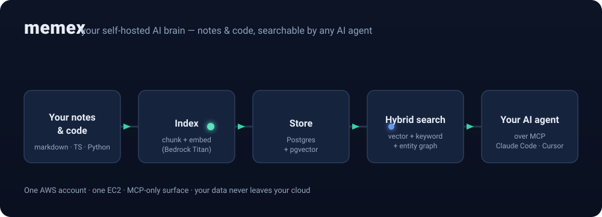
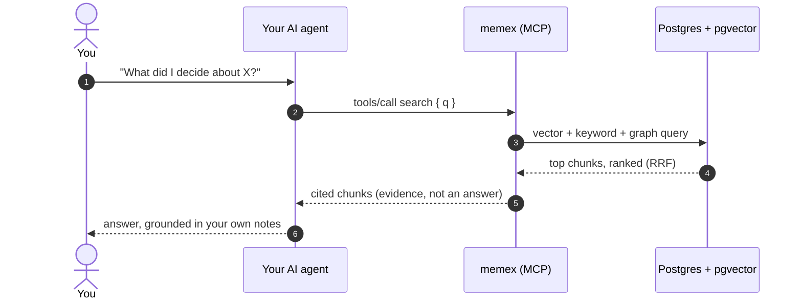

<div align="center">

# memex

### Long-term memory for your AI agent &mdash; that never leaves your cloud.

Self-hosted on your own AWS. memex indexes your notes and code and lets **any
MCP agent** (Claude Code, Cursor, Codex) search it and **cite the source**.
No SaaS, no telemetry &mdash; your second brain stays yours.

[](./LICENSE)




</div>

---

## What is memex?

You write a lot &mdash; notes, decisions, docs, code. Six months later you can't
find any of it, and your AI assistant has no idea it exists.

**memex is a personal knowledge brain you run in your own cloud.** It reads your
markdown notes and your code, turns them into a searchable index, and hands that
search to your AI agent over the
[Model Context Protocol (MCP)](https://modelcontextprotocol.io). Now your agent
answers *"what did I decide about X?"* with **your own words, cited back to the
exact note** &mdash; instead of guessing.

It's a second brain for you, and long-term memory for your AI.

## See it work

<div align="center">
  
</div>

memex returns the **evidence**, cited to the exact file. Your agent writes the
answer. (The brain retrieves &mdash; it doesn't chat.)

## Why it exists

- **Your knowledge is private.** Most "AI memory" tools upload everything to
  someone else's servers. memex runs entirely inside **one AWS account you
  control** &mdash; your notes never leave your cloud, and there's zero telemetry.
- **One brain, every agent.** It exposes a single MCP endpoint. Any
  MCP-compatible tool connects to it; you don't re-index your life per app.
- **Search that actually finds things.** It blends *meaning* (vector
  embeddings), *exact words* (keyword search), and *relationships* (an entity
  graph) &mdash; so the thing you only half-remember still surfaces.
- **Small and boring on purpose.** No orchestrator, no multi-tenancy, no SaaS to
  depend on. It fits on one small EC2 box, and you can read the whole thing in
  an afternoon.

## How it's different

|  | **memex** | Hosted "AI memory" | A plain RAG script |
|---|:---:|:---:|:---:|
| Your data stays in your cloud | ✅ | ❌ | ✅ |
| Any MCP agent, one shared index | ✅ | sometimes | ❌ |
| Vector **+** keyword **+** entity-graph | ✅ | varies | vector-only |
| Zero telemetry, no SaaS dependency | ✅ | ❌ | ✅ |

**Who it's for:** developers who live in Claude Code / Cursor / Codex,
note-takers with a markdown vault, and anyone who refuses to put their second
brain on someone else's servers.

---

## How it works

memex indexes your content once, then answers searches on demand. When your
agent asks a question, here's the round trip &mdash; note that memex hands back
**evidence**, and the agent composes the answer:



**Under the hood:** a small [Bun](https://bun.sh) + TypeScript service, Postgres
16 with `pgvector`, AWS Bedrock for embeddings, and a Cloudflare Tunnel for
HTTPS &mdash; so no EC2 port is ever exposed. The entire public surface is two
routes: `GET /health` and `POST /mcp`. That's the whole attack surface.

> Full topology, every container, and the security model:
> [**ARCHITECTURE.md**](./ARCHITECTURE.md).

---

## Quickstart

You'll need an **AWS account**, **Terraform 1.6+**, **docker compose v2**, and a
**domain** you control (for the Cloudflare Tunnel).

```bash
git clone https://github.com/<your-org>/memex.git
cd memex

make init     # interactive bootstrap: AWS account, domain, buckets -> .env + tfvars
make audit    # PII / secrets gate (must pass on a clean clone)
make plan     # preview the AWS resources
make apply    # create them
```

`make apply` boots one EC2 host, pulls the repo, fetches secrets from AWS
Secrets Manager, and starts the two containers (`memex` + `cloudflared`). Your
brain is then live at `https://brain.<your-domain>/mcp`.

Connecting Claude Code (or any MCP client):
[**deploy/memex/docs/CLAUDE-CODE.md**](./deploy/memex/docs/CLAUDE-CODE.md).

---

## What's in the box

| Piece | What it does |
|---|---|
| **memex** | The brain: hybrid search, entity graph, code/markdown indexers, MCP server, a self-maintaining background cycle. |
| **cloudflared** | Public HTTPS ingress via Cloudflare Tunnel &mdash; no open EC2 ports. |
| **Terraform** | All AWS infra (VPC, EC2, RDS, EFS, Secrets Manager) as one module. |
| **AWS Bedrock** | Titan v2 embeddings + Nova Lite for query intent. Answer synthesis stays in *your* agent. |

**Learn more:** [ARCHITECTURE.md](./ARCHITECTURE.md) ·
[API / MCP tools](./deploy/memex/docs/API.md) ·
[Operations](./deploy/memex/docs/OPERATIONS.md) ·
[Privacy](./PRIVACY.md) · [Changelog](./CHANGELOG.md)

---

## Like the idea?

If a private, self-hosted brain for your AI agent is something you want to exist,
**give it a ⭐** &mdash; it's the signal that keeps this maintained. Bugs and
ideas welcome in [issues](../../issues).

## Contributing

memex is intentionally **single-user and small** &mdash; open an issue before
anything that adds infrastructure or changes the deploy story. Please read
[CLAUDE.md](./CLAUDE.md) (the repo's working rules) first.

## Security

Found a vulnerability? Please don't open a public issue &mdash;
see [SECURITY.md](./SECURITY.md) for the private disclosure channel.

## License

[MIT](./LICENSE). Fork it, redeploy it, modify it, ship it. Solo-maintained, no
SLA &mdash; if you need guarantees, fork and pin.
