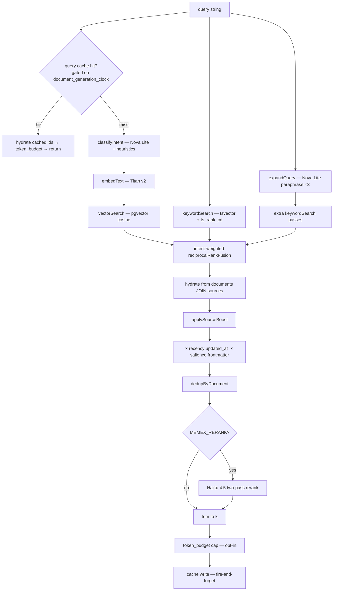

# memex — Architecture

Deep dive into the memex subsystem. For project-level topology see
`ARCHITECTURE.md` at the repo root; this doc covers internal layout,
the schema, the search pipeline, the cycle phases, and operational
boundaries.

## High-level layout

```
deploy/memex/src/
├── cli.ts               argparse + dispatch (17 subcommands)
├── commands/            one .ts per subcommand
├── core/
│   ├── engine/          adapter pattern (PGLite + Postgres)
│   ├── chunkers/        recursive (live), code/semantic stubs
│   ├── search/          hybrid + sub-modules (intent, intent-weights,
│   │                    recency, salience, token-budget, query-cache, …)
│   ├── cycle/           6 maintenance phases + orchestrator
│   ├── output/          progress events + transcripts
│   ├── resolvers/       wikilink + path resolvers (registry-based)
│   ├── migrations/      append-only NNN_*.sql
│   ├── frontmatter.ts   YAML parser
│   ├── embedding.ts     Bedrock Titan v2 client
│   ├── entities.ts      regex extractor (wikilinks/tags/dates)
│   ├── extract.ts       re-extract w/o re-embed
│   ├── backlinks.ts     entity_mentions reverse lookup
│   ├── friction.ts      log + analyse "agent confused" events
│   ├── sources.ts       sources registration / resolver / backfill
│   ├── indexer.ts       chunks → embed → write transaction
│   ├── migrate.ts       versioned migration runner
│   ├── rrf.ts           Reciprocal Rank Fusion (Cormack k=60)
│   ├── sweep.ts         vault walk + change detection
│   ├── storage.ts       thin façade over Engine
│   └── config.ts        JSON + YAML + env layered loader
├── http/                two contract routes: /health + /mcp
│                        (legacy REST routes removed in A.7 — all via /mcp)
├── mcp/                 JSON-RPC 2.0 transport + dispatch
├── recipes/             cycle (6h maintenance tick)
└── tests/               120 Bun tests
```

## Engine adapter

`core/engine/interface.ts` declares a narrow surface — `kind`, `query`,
`exec`, `ready`, `close` — that PGLite and Postgres both implement.
`core/engine/factory.ts` instantiates the right adapter based on
`config.database.type` (`pglite | postgres`).

Production runs `postgres` against the RDS instance defined in
`terraform/rds.tf`. PGLite is **dev-only** and serves three narrow
purposes:

- `init --pglite` creates a local store for fresh installs / contributor dev
- the test suite uses it as a cheap backing — no RDS required for `bun test`
- `migrate-engine --from postgres --to pglite` ferries data when
  re-provisioning RDS in another account

The migrations are engine-agnostic SQL — `vector(1024)`, `tsvector
GENERATED ALWAYS AS`, `jsonb`, HNSW, `TIMESTAMPTZ DEFAULT NOW()` —
all portable. So adding new schema today only needs a new
`migrations/NNN_*.sql` file, not adapter-specific code.

## Schema

```mermaid
erDiagram
  sources ||--o{ documents : has
  documents ||--o{ chunks : contains
  chunks ||--|| embeddings : embeds
  chunks ||--o{ entity_mentions : mentions
  entities ||--o{ entity_mentions : referenced_by

  sources {
    text id PK
    text kind "vault|memory|webhook|mailbox|calendar|transcript|other"
    text path_prefix
    text sync_policy "synced|local-only|mirror"
    text indexed_policy "verbatim|hashed-only|tombstoned"
  }
  documents {
    text id PK
    text source_path
    text title
    jsonb frontmatter
    text source_id FK
    bigint last_indexed_mtime
  }
  chunks {
    text id PK
    text document_id FK
    int chunk_index
    text content
    tsvector ts "GENERATED"
  }
  embeddings {
    text chunk_id PK_FK
    vector_1024 vector
    text model
  }
  entities {
    text id PK
    text type "wikilink|tag|date"
    text name
  }
  entity_mentions {
    text chunk_id FK
    text entity_id FK
    text surface_form
  }
```

Plus three append-only telemetry tables:

- `migrations` (id, name, applied_at)
- `cycle_snapshots` (every 6 h tick — counts of docs/chunks/embeddings/entities/mentions)
- `friction_events` (kind, query, reason, source_path, extra)

Migration files live in `src/core/migrations/`:

| ID | Name |
|---|---|
| 001 | initial — documents, chunks, embeddings + HNSW |
| 002 | entities — entities, entity_mentions, last_indexed_mtime |
| 003 | cycle_snapshots |
| 004 | sources |
| 005 | friction |

Append-only convention: never edit a shipped migration; ship a new one.

## Search pipeline



**Ranking signals** (all gentle, post-fusion, neutral when their input is
absent — `core/search/`):
- **intent-weighted RRF** (`intent-weights.ts`): `exact`/`factual` lean
  keyword, `topic`/`personal` lean vector, `howto` balanced (0.7–1.4×).
- **recency** (`recency.ts`): floor-bounded decay on `documents.updated_at`
  (half-life ~120 d, floor 0.6×).
- **salience** (`salience.ts`): frontmatter `pinned:true` → ≥1.3×,
  `weight:<n>` → clamped 0.5–2.0×.
- **source-boost** weights: `vault=1.0`, `memory=0.7`, `webhook=0.5`,
  `mailbox=0.6`, `calendar=0.6`, `transcript=0.65`, `other=0.8`.

**Query cache** (`query-cache.ts`, migration 026): exact-match, on by default,
fail-open. Keyed on the live-model `document_generation_clock` (migration 025,
bumped on every document write), so any ingest invalidates it. Stores chunk
ids only (re-hydrated from live tables); a hit skips embed/intent/retrieval.
Disable per-call with `noCache` or globally with `MEMEX_QUERY_CACHE=0`.

**token_budget** (`token-budget.ts`): optional `search` param caps total
returned context (~chars/4); the overflowing tail hit is truncated and
flagged `truncated:true`.

Two-pass rerank is opt-in via `MEMEX_RERANK=1` env (Haiku is paid;
default off keeps cost on Bedrock credit-eligible models).

## Cycle pipeline

Runs every 6 h via `recipes/cycle.ts`. Six phases in order; one
failing doesn't stop the others:

1. **embed-stale** — re-embed chunks whose embeddings are older than
   `staleDays` (default 30). Skipped during the configured quiet
   hours so it doesn't fight interactive MCP recall traffic.
2. **extract** — re-run the regex entity extractor on every chunk.
   Cheap (no Bedrock).
3. **reconcile-links** — find `[[wikilinks]]` that don't resolve to
   any document. Read-only; report only.
4. **orphans-purge** — delete embeddings/entity_mentions/entities
   without parents. Flag (don't delete) docs missing on disk and
   docs with zero chunks.
5. **frontmatter-inference** — fill missing `title` (from H1), `tags`
   (from inline `#hashtags`), `created` / `updated` (from
   `ingested_at` / `updated_at`). Idempotent.
6. **snapshot** — append a row to `cycle_snapshots` so `reports`
   can render trends.

## MCP JSON-RPC transport

`POST /mcp` accepts JSON-RPC 2.0. Methods:
- `initialize` — handshake, returns server info + capabilities
- `tools/list` — returns the 5 tool defs from `mcp/tool_defs.ts`
- `tools/call` — invokes a tool, returns content blocks
- `ping` — `{}`

Tools: `search`, `index`, `backlinks`, `stats`, `log_friction`.

Per-IP rate limit (token bucket, default 60 req/min). Configurable
via `mcp.rate_limit_per_minute` in `memex.yml`.

## Soul / identity files

`init` seeds 4 templates into `~/.memex/`:
- `SOUL.md` — agent identity (voice / values / hard constraints)
- `USER.md` — user profile
- `ACCESS_POLICY.md` — channel-by-channel capabilities
- `HEARTBEAT.md` — operational state

Mode `0600`. Reserved for future agent-side consumption.

## Bedrock model wiring

| Use | Model | Cost |
|---|---|---|
| Embeddings | `amazon.titan-embed-text-v2:0` | credit-eligible |
| Query intent (internal) | `global.amazon.nova-2-lite-v1:0` | credit-eligible |
| Query expansion (internal) | `global.amazon.nova-2-lite-v1:0` | credit-eligible |
| Two-pass rerank (opt-in) | `eu.anthropic.claude-haiku-4-5-20251001-v1:0` | paid (~$1-3/mo if `MEMEX_RERANK=1`) |

Answer synthesis is not performed by memex — the MCP client (Claude
Code, Cursor, …) composes answers from the cited chunks memex returns.

Auth: EC2 IAM role + `AWS_PROFILE=default` env + container-mounted
`~/.aws/config` (`credential_source = Ec2InstanceMetadata`).

## Configuration layering

Highest precedence → lowest:

1. `MEMEX_*` env vars (containers / one-off CLI invocations)
2. `~/.memex/memex.yml` (declarative knob panel — sweep delays,
   cycle intervals, MCP rate limits, vault paths)
3. `~/.memex/config.json` (boot-essentials only — db type/path,
   embedding provider/model/region; written by `init`)
4. defaults compiled into `core/config.ts`

`config.ts::loadConfig` does the merge. The factory then instantiates
the engine from the merged shape.

## Security boundary

- memex binds `0.0.0.0:18790` inside its container but the port
  is `expose:` only — never `ports:` — so it's reachable only on the
  Docker `internal` network and through Cloudflare Tunnel for the
  `brain.<domain>/mcp` public surface.
- All state outside `node_modules` lives on EFS / RDS — container is
  stateless and re-creatable.
- The Postgres SG only allows ingress 5432 from the stack EC2 SG.
- Friction events MAY contain user queries; treat the
  `friction_events` table as private. Public-bearer reads are gated
  on the `FORBIDDEN_MCP_TOOLS_FROM_PUBLIC` allowlist in
  `mcp/dispatch.ts`; the read-tools allowed are: `search`,
  `backlinks`, `stats`, `page_{get,list,versions}`,
  `graph_{neighbors,query}`, `entity_{facts,timeline,recall}`,
  `jobs_{list,get,logs}`. Writes require `MEMEX_INTERNAL_TOKEN`
  on the internal bridge.
