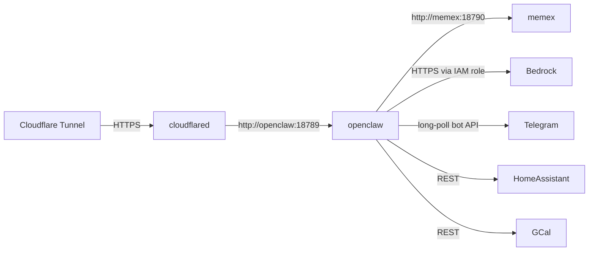

# openclaw — Architecture

## Container shape

```
node:22-alpine
├── apk: python3, py3-requests, jq, curl, bash, aws-cli, git
├── npm: openclaw@2026.4.29 (global)
├── helpers/{gcal,ha,obsidian,memex} → /opt/<project>/bin/
└── entrypoint.sh
```

`git` and `aws-cli` are non-obvious requirements: the openclaw runtime
shells out to `git` for plugin staging and to `aws` for Secrets
Manager reads at boot. Removing either breaks the chat surface.

## Network



- All container-to-container traffic is on the `internal` Docker bridge.
- No public ingress except via cloudflared.
- Bedrock auth uses the EC2 IAM role; `aws-cli` in the container speaks
  to IMDS via `~/.aws/config` mounted from the host.

## State (EFS bind mounts)

Granular mounts — never the whole EFS root, because stray
`plugin-runtime-deps/openclaw-X` directories from prior installs can
wedge the runtime mirror lock:

| Container path | EFS path | Purpose |
|---|---|---|
| `~/.openclaw/cron/` | `cron/` | scheduled jobs (morning-briefing) |
| `~/.openclaw/devices/` | `devices/` | paired web devices, tokens |
| `~/.openclaw/tasks/` | `tasks/` | task system state |
| `~/.openclaw/agents/` | `agents/` | per-agent config |
| `~/.openclaw/flows/` | `flows/` | flows |
| `~/.openclaw/telegram/` | `telegram/` | TG provider state |
| `~/.openclaw/identity/` | `identity/` | gateway identity |
| `~/.openclaw/delivery-queue/` | `delivery-queue/` | undelivered notifs |
| `~/.openclaw/credentials/` | `credentials/` | agent creds |
| `~/.openclaw/canvas/` | `canvas/` | UI canvas state |
| `~/.openclaw/media/` | `media/` | TG attachments etc. |
| `~/.openclaw/workspace/` | `workspace/` | session memory + `.gateway-token` |
| `~/.openclaw/skills/` | `skills/` (read-only) | the 9 markdown skills |
| `/mnt/<project>-efs/<project>/vault/` | `vault/` | direct vault access |

`plugin-runtime-deps/` lives inside the container image and is rebuilt
per `npm openclaw@<version>` — never on EFS.

## Bedrock model wiring

| Use | Model ID |
|---|---|
| Primary chat | `global.amazon.nova-2-lite-v1:0` (credit-eligible) |
| Embeddings | `amazon.titan-embed-text-v2:0` (used by memex) |
| Escalation | `eu.anthropic.claude-haiku-4-5-20251001-v1:0` (paid) |

Set in `config.template.json`. Heartbeat is intentionally disabled
(`agents.defaults.heartbeat.every=""`) — see CLAUDE.md.

## Auth token rotation

The gateway auth token is sourced from AWS Secrets Manager at
`<secrets_prefix>/gateway-token` (KMS-encrypted, CloudTrail-audited).
The entrypoint falls back to an EFS-persisted token at
`workspace/.gateway-token` only when the secret is absent (legacy
pre-Secrets-Manager installs). Rotate by `put-secret-value` on the
secret and restarting the container; all devices need re-pairing.

## Plugin-version gotcha

We pin `openclaw@2026.4.29` because 2026.5.x introduced a ~3-min
plugin-staging regression on first boot. Bump intentionally and
smoke-test before rolling forward. The pin lives in `Dockerfile` at
the `npm install -g openclaw@2026.4.29` line.
